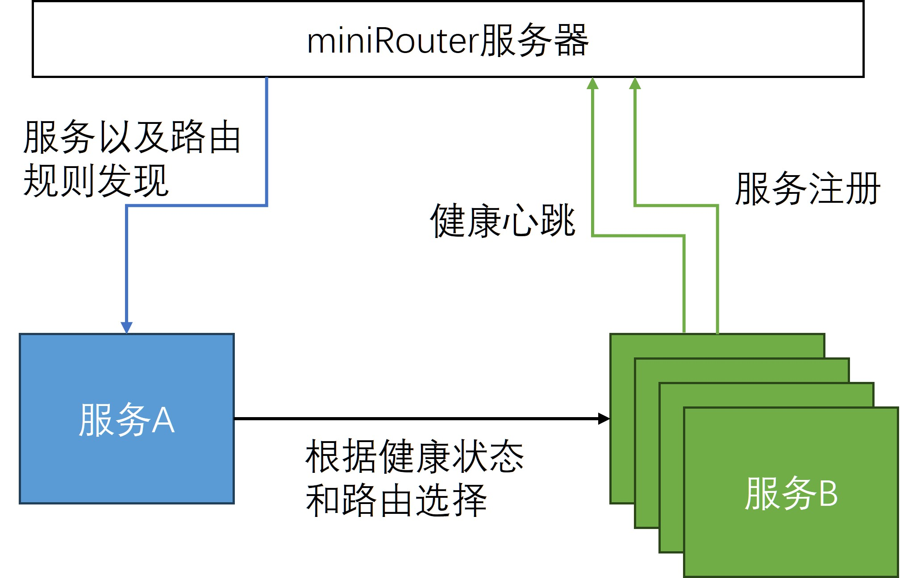
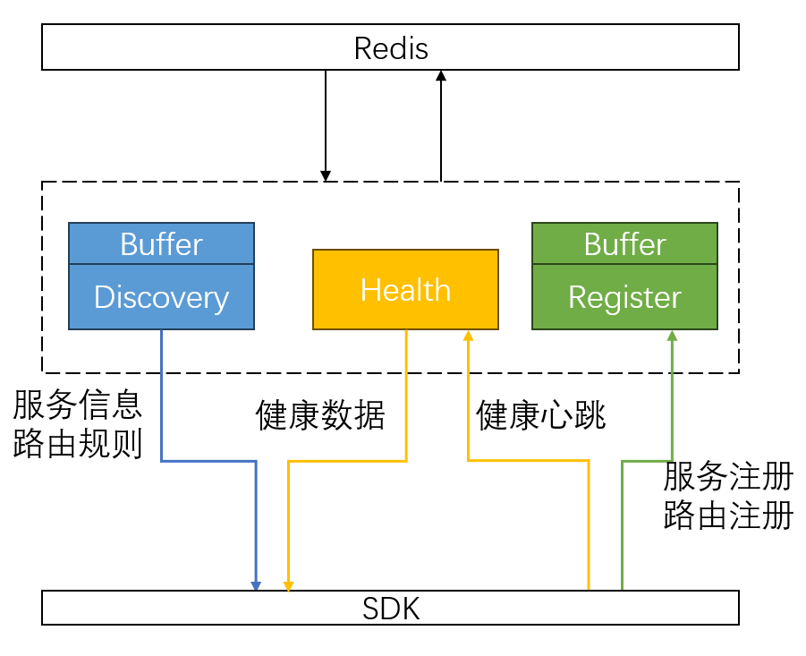

# Supernove2024

2024年腾讯超新星比赛后台项目中期报告

## 题目分析

### 功能分析

在多个微服务组成的游戏服务器中，为了支持有状态服务，同时也为了进行负载均衡，必然会需要对某个服务进行发现和路由转发的功能。本次超新星的题目就是实现一个能够进行服务和路由管理的框架，它包含的基本功能如下：

1. 服务注册与反注册。一个服务启动时，将其注册到我们的服务器，可供其他服务实例获取；当它结束时，它可以将自己反注册，从我们的服务器中删除。
2. 服务发现，根据筛选条件向客户端返回服务实例。服务发现功能在返回服务实例的时候需要考虑服务实例是否处在健康状态。
3. 健康监测，服务实例需要定期上报心跳，这样服务器会更新它的健康状态来确定服务是否还在线，是否还能正常访问。
4. 常规路由匹配规则，支持三个常规路由匹配规则。一致性哈希，随机路由匹配，基于权重的路由匹配。
5. 定义路由匹配规则，两种路由匹配规则，第一种是指定目标路由，指定目标路由可以将两个服务实例一一对应起来；第二种是键值对路由，发送的信息中只要携带特定的key就会转发到特定的服务实例上。

我们需要提供一个基本SDK框架，使用户能够通过API接口方便快捷的使用我们的功能，SDK和服务器之间使用gRPC链接。项目功能结构图如下：



### 性能需求分析

1. 自定义路由匹配规则需要支持千万级别的路由表，能够快速并且节约资源的情况下进行查找
2. 服务注册和服务发现功能需要支持上万服务实例，
3. 分析SDK性能占用。考虑到SDK会运行在服务实例上，为了避免影响服务实例的性能，应该尽可能使SDK轻量级，减少SDK的CPU时间和服务占用
4. 对路由规则进行压力测试，分析并验证性能是否符合要求

## 系统设计

在接下来，我们使用MiniRouter来命名我们设计的服务管理系统。

### redis数据设计

redis储存服务实例信息、健康信息、路由信息三种数据，其中服务实例信息`ServiceInfo`和路由信息`ServiceRouterInfo`被protobuf打包为二进制格式储存，他们的protobuf格式是：

```protobuf
message InstanceInfo {
  string InstanceID = 1;
  string Host = 2;
  int32 Port = 3;
  int32 Weight = 4;
}

message ServiceInfo {
  string ServiceName = 1;
  int64 Revision = 2;
  repeated InstanceInfo Instances = 3;
}

message TargetRouterInfo{
  string SrcInstanceID = 1;
  string DstInstanceID = 2;
  int64 Timeout = 3;
  int64 CreateTime = 4;
}

message KVRouterInfo{
  string Key = 1;
  string DstInstanceID = 2;
  int64 Timeout = 3;
  int64 CreateTime = 4;
}

message ServiceRouterInfo{
  string ServiceName = 1;
  int64 Revision = 2;
  repeated TargetRouterInfo TargetRouters = 3;
  repeated KVRouterInfo KVRouters = 4;
}
```

**服务实例信息**：对于一个Service，我们在proto中定义了一个ServiceInfo，在redis中储存它的protobuf形式和Revision

| 资源   | redis类型 | key              | filed                | value   | 数据类型        |
| ---- | ------- | ---------------- | -------------------- | ------- | ----------- |
| 服务版本 | hash    | Hash.Service.服务名 | ServiceRevisionFiled | 版本号     | int64       |
| 服务信息 | hash    | Hash.Service.服务名 | ServiceInfoFiled     | 服务和实例数据 | ServiceInfo |

**健康信息**：redis储存方式如下，由于健康信息更新很频繁，往往几秒就要更新一次，每个实例更新的时间各有不同，不适合将他们使用protobuf打包成二进制存放，也不适用版本号记录更新，所以将每个

| 资源   | redis类型 | key                  | filed         | value     |
| ---- | ------- | -------------------- | ------------- | --------- |
| 健康数据 | hash    | Hash.Health.服务名.实例ID | TTL           | 超时上报间隔    |
| 健康数据 | hash    | Hash.Health.服务名.实例ID | LastHeartBeat | 最后一次上报的时间 |

**路由信息**：和服务实例信息储存的方式相似，

| 资源   | redis类型 | key             | filed               | value | 数据类型              |
| ---- | ------- | --------------- | ------------------- | ----- | ----------------- |
| 路由版本 | hash    | Hash.Router.服务名 | RouterRevisionFiled | 版本号   | int64             |
| 路由信息 | hash    | Hash.Router.服务名 | RouterInfoFiled     | 路由数据  | ServiceRouterInfo |

### 服务器设计

使用Redis保存数据,将MiniRouter分为3个微型服务器，结构如下图所示


#### Discovery Svr

提供服务发现，路由发现的功能，根据SDK提供的服务名查询对应的数据并且下发给SDK。

Discovery Svr会在本地缓存一个版本的服务实例数据和路由数据。当需要下发数据的时候，先取Redis的版本号，然后判断与本地版本是否一致，一致就不需要再从Redis中读取数据了，直接将本地缓存的数据下发。否则从Redis中读取数据再更新缓存，最后再下发，通过缓冲区减小redis读写的压力。

Discovery Svr提供如下gRPC接口

##### GetInstances

GetInstances根据提供的参数查询并返回对应的实例信息，gRPC协议如下：

```protobuf
message GetInstancesRequest{
  string ServiceName = 1;
  int64 Revision = 2;
}
message GetInstancesReply{
  ServiceInfo service = 1;
}

rpc GetInstances(GetInstancesRequest) returns (GetInstancesReply){}
```

服务器会首先对比SDK提供的Revision和现在最新的Revision是否一致，如果一致，那么就会返回一个空的ServiceInfo，否则就返回最新的ServiceRouterInfo。避免每次都全量输出数据，造成流量的浪费

##### GetRouters

GetRouters根据提供的服务名返回该服务相关的路由信息，gRPC协议如下：

```protobuf
message GetRoutersRequest{
  string ServiceName = 1;
  int64 Revision = 2;
}

message GetRoutersReply{
  ServiceRouterInfo router = 1;
}

rpc GetRouters(GetRoutersRequest) returns (GetRoutersReply){}
```

GetRouters首先对比参数提供的Revision和现在最新的Revision是否一致，如果一致，那么就返回一个空的ServiceRouterInfo，否则就返回最新的ServiceRouterInfo。

#### Register Svr

提供服务注册，服务反注册，添加路由规则，删除路由规则的功能。

和Discovery Svr一样本地缓存了当前的数据，按照`map[服务名][实例ID]*实例信息`，`map[服务名][路由ID]*路由信息`的形式将其组织为字典结构，方便快速查找服务/路由是否是已经注册过了。

Register Svr提供如下RPC接口

##### Register

Register提供了服务注册接口，一个新的服务实例上线时，通过这个接口将自己注册到服务器，这样其他的服务就可以发现它。

它的gRPC协议如下：

```protobuf
message RegisterRequest{
  string ServiceName = 1; // 服务名称
  string Host = 2;        // IP地址
  int32 Port = 3;         // 端口
  int32 Weight = 4;       // 权重
  int64 TTL = 5;          //上报时间间隔

  //可选，如果不设置那么服务器将其设置为IP:Port
  optional string InstanceID = 6;
}
message RegisterReply{
  string InstanceID = 1;
}

rpc Register(RegisterRequest) returns (RegisterReply){}
```

Register会先同步本地数据到最新，然后检查地址和InstanceID是否已经被注册，如果被注册，那么就会组织注册然后返回错误；如果没有被注册，那么就在版本号上加1，添加新的Instance，接着将更新的数据发送到Redis。

##### Deregister

Deregister提供了反注册接口，服务实例下线前，应该进行反注册。它的gRPC定义如下：

```protobuf
message DeregisterRequest{
  string ServiceName =1;
  string InstanceID = 2;
  string Host = 3;
  int32 Port = 4;
}

message DeregisterReply{
}

rpc Deregister(DeregisterRequest) returns (DeregisterReply){}
```

Deregister会让服务器同步本地数据到最新，然后更新版本号并且删除对应Instance信息，然后更新Redis数据。如果传递的InstanceID和地址不匹配，那么该请求会报错；如果删除的实例不存在，那么该请求不会报错，也不会修改数据，会直接返回。

##### AddRouter

AddRouter提供了添加路由规则的接口，新的**指定目标路由规则**和**键值对路由规则**可以使用这个接口添加，它的gRPC定义为：

```protobuf
message AddRouterRequest {
  int32 RouterType = 1;   // 路由类型
  string ServiceName = 2; // 服务名称

  // 键值对路由信息
  optional KVRouterInfo KvRouterInfo = 3;
  // 指定目标路由信息
  optional TargetRouterInfo targetRouterInfo = 4;
}
message AddRouterReply {
}

rpc AddRouter(AddRouterRequest) returns (AddRouterReply){}
```

AddRouter会先同步本地数据到最新，然后检查是否已经有冲突的路由规则，如果已经存在，那么会报错。如果没有，那么更新版本号和数据，发送到redis

##### RemoveRouter

RemoveRouter提供了删除路由规则的接口，它的gRPC接口定义如下：

```protobuf
message RemoveRouterRequest{
  int32 RouterType = 1;
  string ServiceName = 2;

  optional KVRouterInfo KvRouterInfo = 3;
  optional TargetRouterInfo targetRouterInfo = 4;
}

message RemoveRouterReply {
}

rpc RemoveRouter(RemoveRouterRequest) returns (RemoveRouterReply){}
```

Deregister会让服务器同步本地数据到最新，然后更新版本号并且删除对应路由信息，然后更新Redis数据。如果路由信息不存在，那么会直接返回。

#### Health Svr

提供心跳上报和健康信息获取的功能。

健康信息没有数据缓存和版本号，因为预计更新会非常频繁，没有缓存的必要性，每次读写数据都会从redis中获取。当读写大量服务的健康数据时，为了优化数据传输效率，使用Pipeline来传递命令。

##### HeartBeat

HeartBeat提供心跳汇报，它的gRPC定义如下

```protobuf
message HeartBeatRequest{
  string ServiceName =1;
  string InstanceID = 2;
}

message HeartBeatReply{
}

rpc HeartBeat(HeartBeatRequest) returns (HeartBeatReply) {}
```

HeartBeat发送到服务器后，服务器会立刻更新Redis中对应服务实例的健康信息

##### GetHealthInfo

GetHealthInfo返回健康信息，gRPC定义如下：

```protobuf
message GetHealthInfoRequest{
  string ServiceName = 1;
}

message GetHealthInfoReply{
  ServiceHealthInfo HealthInfo = 1;
}

rpc GetHealthInfo(GetHealthInfoRequest) returns (GetHealthInfoReply){}
```

健康信息没有版本号和缓存，直接读取Redis中每个实例的hash并返回结果，考虑到会一次从Redis中读取大量的Hash，使用Pipeline优化传输效率

### SDK设计

使用grpc作为SDK和服务器通信的协议，因为服务器分为三个微服务
SDK也会分为三个部分，分别是DiscoveryAPI、HealthAPI，RegisterAPI，每个部分对应一个独立的微服务的功能。

#### SDK结构

SDK设计如下图所示：


本地缓存和链接管理都是单例模式，一个程序中无论创建多少个API，他们都使用同一个本地缓存和链接管理器。

上报数据的RegisterAPI和HealthAPI并不访问本地缓存，而是直接连接到服务器。查询数据为主的DiscoveryAPI会访问本地缓存的数据，而不直接访问远程服务器，本地缓存有一个独立线程负责定期更新本地数据来和远程服务器保持一致。

#### 配置文件设计

使用yaml作为配置文件，配置文件要指明三个微务器集群的地址和其他服务配置

以下面的文件为例子：

```yaml
Global:
  RegisterService:
    - Host: 127.0.0.1
      Port: 8001
    - Host: 127.0.0.1
      Port: 9001
  DiscoverService:
    - Host: 127.0.0.1
      Port: 8002
  HealthService:
    - Host: 127.0.0.1
      Port: 8003
  Register:
    DefaultWeight: 10
    DefaultTTL: 2
  Discovery:
    DefaultTimeout: 1
    DstService:
      - testDiscovery
```

RegisterService，DiscoverService，HealthService指明了DiscoverySvr，RegisterSvr，HealthSvr服务器的地址，每个服务器地址可以提供多个，以便于SDK在初始化的时候进行选择。

Register定义了服务注册相关的基本设置，包括服务注册的默认权重DefaultWeight和服务默认的TTL（Time To Live）

Discovery定义了服务发现相关的基本配置，DefaultTimeout定义了SDK数据缓冲区拉取数据的基本时间间隔，DstService提供了一系列的服务名，这些服务名称都是需要拉去的服务对象。

#### 数据同步设计

第一次启动SDK的时候会自动拉去一次数据，之后根据配置定时触发数据拉取，根据配置中注册的本地数据更新任务，每过一段时间就自动拉取一次

> 一开始设计的，配置文件中没有设置需要拉去的服务名，然后当用户GetInstances的时候，SDK检查本地是否有数据，如果没有就拉取对应的数据，但是这个有一个问题，每次用户Get都有可能触发一次拉取，这导致Get不能充分利用读写锁。
> 
> 我们设想一下这样一个场景，用户多线程调用GetInstance(ServiceA)，查询时如果使用读锁，那么第一个请求和第二个请求同时查询，同时发现ServiceA不存在，然后两个都请求写锁进行写入，一个先一个后会写入两次，想要避免这个状况就必须在查询的时候使用写锁，这样只有一个会进行查询，但是这样做很明显不太符合SDK查多写少的情况。
> 
> 通过提前注册好需要拉取的服务，定时拉去，将查询和拉取分离成两个操作，充分利用读写锁的特性。

#### DiscoveryAPI接口

###### 服务发现

GetInstances根据参数返回对应服务的实例信息

```go
type GetInstancesArgv struct {
    ServiceName      string // 服务名称
    SkipHealthFilter bool   // 是否跳过健康检测，跳过的话，结果中会包含不健康的实例
}

type GetInstancesResult struct {
    ServiceName string             // 服务名称
    Instances   []*pb.InstanceInfo // 所有的实例信息
}
GetInstances(argv *GetInstancesArgv) (*GetInstancesResult, error)
```

GetInstances会从缓冲中读取数据，然后根据SkipHealthFilter对其进行健康监测，`LastHeartBeat + 3 * TTL < 当前时间`的实例会被认为时不健康的

###### 路由应用

ProcessRouter可以根据提供的目标服务信息和路由规则，返回符合路由规则的实例

```go
type DstService interface {
    GetServiceName() string
    GetInstance() []*pb.InstanceInfo
}

type ProcessRouterArgv struct {
    Method        int32      // 选择的路由方法
    SrcInstanceID string     // 实例ID
    DstService    DstService // 目标服务信息
    Key           string     // 可选的，只有键值对路由需要
}

type ProcessRouterResult struct {
    DstInstance *pb.InstanceInfo
}

ProcessRouter(*ProcessRouterArgv) (*ProcessRouterResult, error)
```

在`ProcessRouter`中，`GetInstancesResult`可以直接作为`DstService`使用，目前支持的路由规则有：

1. 哈希一致性路由
2. 随机路由
3. 根据权重选择最大的路由
4. 指定目标路由
5. 键值对匹配路由

#### RegisterAPI接口

##### 服务注册与反注册

Register注册服务，Deregister反注册服务

```go
Register(service *RegisterArgv) (*RegisterResult, error)
Deregister(service *DeregisterArgv) error
```

他们会直接调用服务器对应rpc接口

##### 路由注册

支持注册两种路由规则，AddKVRouter注册键值对路由，AddTargetRouter注册制定目标路由

```go
AddTargetRouter(*AddTargetRouterArgv) error
AddKVRouter(argv *AddKVRouterArgv) error
```

#### HealthAPI接口

##### 心跳上报

HeartBeat对服务器进行心跳数据的上报，

```go
HeartBeat(*HeartBeatArgv) error
```

HeartBeat只需要提供自身服务的InstanceID即可，服务器会更新Redis中记录的最后心跳时间，延长服务寿命。

## 工作进度

### 服务器已经实现的部分

1. 完成了服务器本地缓冲区的实现
2. 已经完成所有的gRPC协议实现
3. 完成了链接并更新Redis数据的功能
4. 服务器基本功能跑通并在test中有对应的测试

### SDK已经实现的部分

1. 实现了所有的API接口
2. 完成了本地缓存与自动更新
3. 已经跑通和服务器的联调
4. 在test中有对应的测试

## 未来工作计划

1. SDK支持路由删除
2. 增加压力测试，测试并分析性能是否满足要求，根据Profile分析结果进行优化
3. 测试读写锁相比于普通锁是否有性能提升，会不会因为写饥饿影响性能
4. 尝试添加sidecar模型，来实现透明化的服务管理
5. 将实现的sidecar其运行在minikube中
6. 在参考北极星的基础上，将项目的SDK和RPC调用集成起来，协调运转
7. 尝试扩展支持更丰富的路由规则，使用前缀树等算法优化路由规则匹配

## 项目结构

- cmd: 存放服务器对应的main函数入口
- sdk: 客户端所使用的sdk代码
- svr: 服务器对应的代码
- pb：gRPC协议代码
- test：测试代码
- util：一些服务器和客户端都可能用到的通用组件
- document：存放README用到的图片资源等
